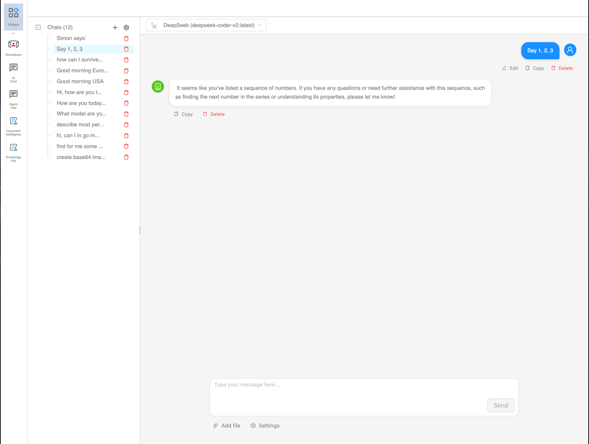
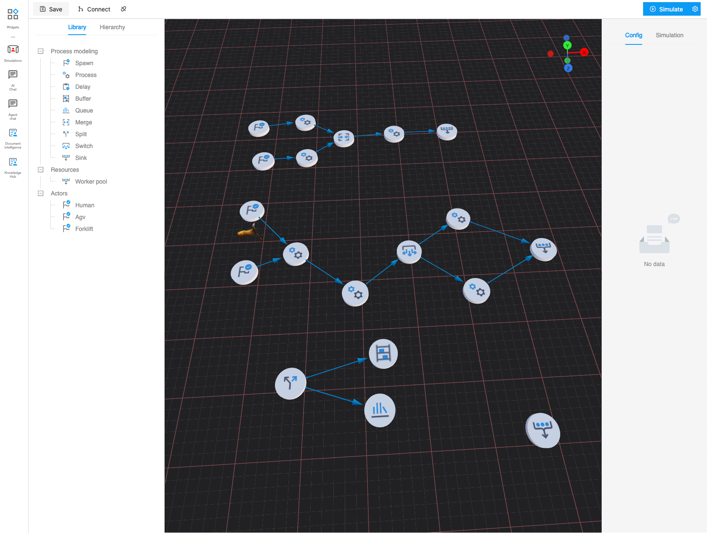

Hi folks,

Turtle Intelligence is summary of everythin I have learn across many years, this is master priece created by hours and
hours of tutorial, youtube videos, testing and reading books. The paltform is also part of my Phd study which helped to create articles.

# 1. Articles with Turtle Intelligence

## 1.1. Agentic management

This article is about use agents into the management of the company.

## 1.2 Artificial organic factory

Article is about using LLM in dynamic reconfigurable factory which server as simulation of life
searching for resources and optimizing communication between them.

## 1.3 Need for simulation inside ERP systems

This article is about need of combination of event driven simulation with ERP systems.

## 1.4 Knowledge base and knowledge graph in companies

This article is about combination of usage data mesh and knowledge graph to leverage company processes.

# 2. Platform modules

## 2.1. Forecasting

Forecasting is method where you try to predict the next state of the system. In the industrial enginering there are
multiple the well known methods to achieve this process.

Methods of forecasting:

- **Exponential smoothing**
- **Linear smoothing**
- **Winter-Holt** for prediction of seasonal stocks

## 2.2. AI Chat

This is basic chat proxying Ollama chat.

## 2.3. AI Chat Embedding

Functionality of the chat is nice, can help, but what the purpose of Turtle Intelligence is Embedding. Main purpose of
the turtle
engine is to create architecture for embdding LLMs into the existing applications.

## 2.4. Simulations

One of Turtle Intelligence modules is dynamic event simulations. Similary as the Siemens Tecnomatix or Anylogic platform
also support this kind of simulation. Advantage of this platform is to have everything on the one place.

## 2.5. Resources

Resources is module for evidence of any kind of resources and categorizing them. With Turtle Architecture you can create
your own ERP module.

